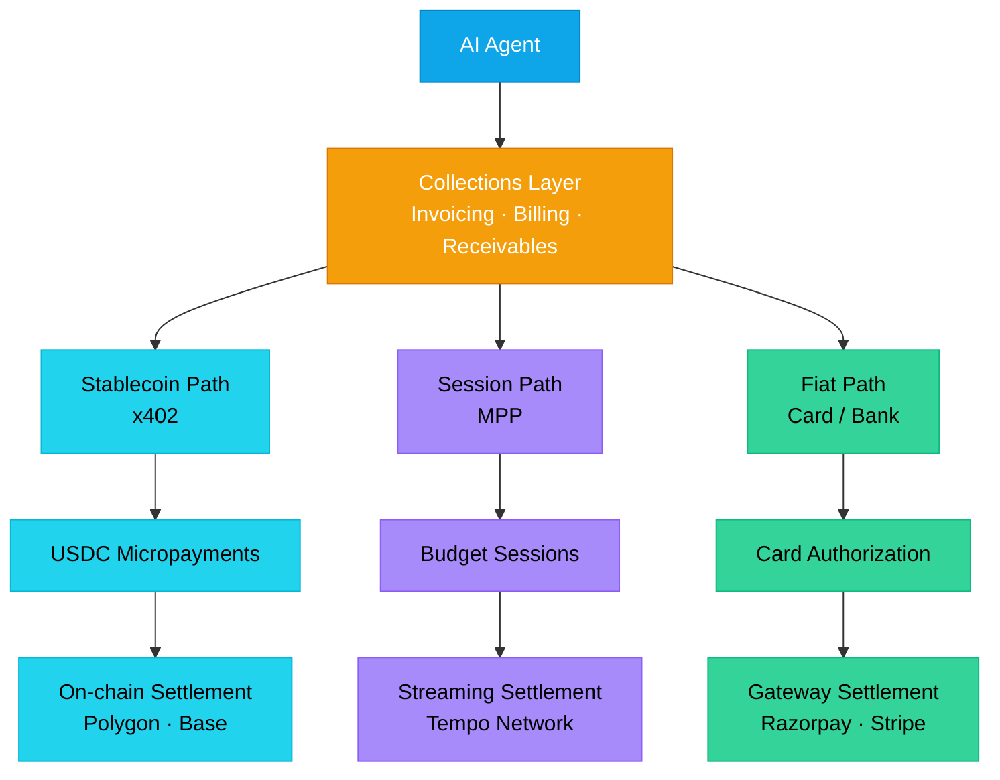

# MoltPe Agent Payments

Payment infrastructure for AI agents — reference implementation with x402, MPP, and fiat payment paths.

[](LICENSE)
[](LICENSE-CONTENT)
[](https://github.com/umangbuilds/moltpe-agent-payments/actions/workflows/tests.yml)
[](https://www.npmjs.com/package/@moltpe/mcp-payments)
[](https://www.npmjs.com/package/@moltpe/x402-client)
[](https://github.com/umangbuilds/moltpe-agent-payments)
[](https://codespaces.new/umangbuilds/moltpe-agent-payments)
[](https://smithery.ai/servers/umg-gpt/moltpe)

> **Disclaimer:** This is a reference implementation with mock data. For production, implement real PaymentProvider adapters. MoltPe's production server is at moltpe.com/mcp.

## What This Is

This repository contains a reference implementation for handling payments in AI agent systems. It supports three payment paths: stablecoin micropayments (x402), session-based streaming (MPP), and traditional fiat rails. The goal is to show how agents can pay, get paid, and manage money across different protocols.

## Quick Start

```bash
# MCP Server — payment tools for AI agents
cd mcp-server && npm install && npm start
# Server runs on port 3000 with 11 MCP tools
# Connect Claude Desktop with config from examples/claude-desktop-config.json

# x402 Client — stablecoin micropayments
cd x402-client && npm install && npm run build
# Use in your project:
# import { pay } from '@moltpe/x402-client'
```

See [mcp-server/README.md](mcp-server/README.md) and [x402-client/README.md](x402-client/README.md) for full usage.

## Demo

Start the server and open http://localhost:3000 to explore all 11 payment tools interactively.

The demo includes:
- Tool explorer with editable inputs for every MCP tool
- Live balance tracking across stablecoin, session, and fiat providers
- MPP session budget visualizer with real-time progress
- Invoice lifecycle: create → send → track → collect
- Transaction timeline of all actions

Run with mock data (default) or connect to MoltPe's live MCP server.

See [mcp-server/DEMO.md](mcp-server/DEMO.md) for a step-by-step walkthrough.

## Live Mode

```bash
cd mcp-server
PROVIDER_MODE=live MOLTPE_AGENT_TOKEN=swai_... npm start
```

Connects to moltpe.com/mcp for real on-chain transactions. See [mcp-server/README.md](mcp-server/README.md#connect-to-live) for setup.

## What's Inside

| Directory | Description |
|-----------|-------------|
| `research/` | Market research, protocol analysis, competitive landscape |
| `mcp-server/` | MCP payment server with 11 tools, 3 mock providers (x402, MPP, fiat), 53 tests |
| `x402-client/` | TypeScript x402 client SDK with facilitator adapters and interceptors, 34 tests |
| `playbook/` | Build playbook: process, templates, results from building this |
| `docs/` | Architecture docs, protocol landscape, market analysis |

## Tri-Rail Architecture

This implementation supports three parallel payment paths:

- **Path A — Stablecoin (x402):** Per-request micropayments settled on-chain in USDC
- **Path B — Session-based (MPP):** Authorize a budget, stream payments within a session
- **Path C — Fiat:** Traditional card authorization, capture, and settlement

Each path serves different use cases. A collections layer sits above all three to handle agent receivables.



See [docs/tri-rail-architecture.md](docs/tri-rail-architecture.md) for the full breakdown.

## Research Highlights

- Verified agent payment volume is $1.6M/month — not the $43M self-reported (48-86% is artificial). See [research/data/verified-volumes.md](research/data/verified-volumes.md).
- Agent collections/receivables is a near-total market gap — only PayPal MCP exists, ecosystem-locked. See [docs/collections-gap.md](docs/collections-gap.md).
- Four protocols (x402, MPP, ACP, AP2) are converging into layers, not competing head-to-head. See [docs/protocol-landscape.md](docs/protocol-landscape.md).

## Quality & Security

| Metric | Value |
|--------|-------|
| Tests | 87 (53 mcp-server + 34 x402-client) |
| Pass rate | 100% |
| Statement coverage | 86.2% / 95.9% |
| Runtime dependencies | 0 (both packages) |
| npm audit | 0 vulnerabilities |
| Secret scan | 0 findings |

See [QUALITY.md](QUALITY.md) for full coverage breakdowns and scan results.
See [SECURITY.md](SECURITY.md) for vulnerability reporting and security posture.
See [docs/production-security-checklist.md](docs/production-security-checklist.md) for the 64-item production deployment checklist.

## Integration Examples

Looking to integrate MoltPe Agent Payments with your AI framework? These issues track planned integrations with example code:

- **[LangChain tool wrapper](https://github.com/umangbuilds/moltpe-agent-payments/issues/6)** — Use MCP payment tools as LangChain tools
- **[AutoGen agent](https://github.com/umangbuilds/moltpe-agent-payments/issues/7)** — Payment-capable AutoGen agent with budget guardrails
- **[Base Sepolia testnet](https://github.com/umangbuilds/moltpe-agent-payments/issues/8)** — Real on-chain x402 payments on testnet
- **[Webhook notifications](https://github.com/umangbuilds/moltpe-agent-payments/issues/9)** — Event-driven payment notifications
- **[Security hardening docs](https://github.com/umangbuilds/moltpe-agent-payments/issues/10)** — Threat model and hardening guide
- **[Eliza plugin](https://github.com/umangbuilds/moltpe-agent-payments/issues/11)** — Payment plugin for the Eliza agent framework

Contributions welcome — pick an issue and open a PR.

## Deep Dives

Long-form guides covering the MoltPe stack, AI agent payment patterns, and India-specific integration:

**For developers evaluating MoltPe**
- [Why developers choose MoltPe for AI agent payments](https://moltpe.com/blog/why-developers-choose-moltpe-for-ai-agent-payments) — five honest reasons, including the tradeoffs
- [Integrate MoltPe in 5 minutes: developer quickstart](https://moltpe.com/blog/integrate-moltpe-in-5-minutes-developer-quickstart) — REST, MCP, x402, Python — all four integration paths with real code
- [MoltPe vs building your own AI payment stack](https://moltpe.com/blog/moltpe-vs-building-your-own-ai-payment-stack) — the build-vs-buy analysis with real time estimates
- [MoltPe developer experience: a deep dive](https://moltpe.com/blog/moltpe-developer-experience-deep-dive) — error messages, docs, testnet, rate limits
- [The MCP server for AI agent payments, explained](https://moltpe.com/blog/mcp-server-for-ai-agent-payments) — Claude Desktop / Cursor / Windsurf config + tool surface

**For Indian developers and AI startups**
- [AI Agent Payments in India: The Complete Infrastructure Guide (2026)](https://moltpe.com/india) — pillar guide for India
- [The Cost of AI Agent Payments in India: 2026 Benchmark](https://moltpe.com/blog/cost-of-ai-agent-payments-india-2026-benchmark) — 4-scenario cost comparison, 15-28x savings over PayPal
- [USDC payments for Indian developers](https://moltpe.com/blog/usdc-payments-india-developers) — USDC vs Razorpay vs Stripe India vs PayPal
- [Freelance AI developer payments in India](https://moltpe.com/blog/freelance-ai-developer-payments-india) — the forex-avoidance playbook
- [The complete payments stack for Indian AI startups](https://moltpe.com/blog/ai-startup-india-payments-infrastructure) — 3-layer stack: UPI + MoltPe + agent-to-agent
- [x402 protocol for Indian developers](https://moltpe.com/blog/x402-protocol-india-developers) — API monetization in USDC

**Protocols and fundamentals**
- [What are AI agent payments?](https://moltpe.com/blog/what-are-ai-agent-payments)
- [The x402 protocol: complete guide](https://moltpe.com/blog/x402-protocol-complete-guide)
- [Machine Payments Protocol (MPP) guide](https://moltpe.com/blog/machine-payments-protocol-mpp-guide)
- [AI agent spending policies explained](https://moltpe.com/blog/ai-agent-spending-policies-guide)

**Short answers (Q&A format)**
- [What is an AI agent wallet?](https://moltpe.com/answers/what-is-an-agent-wallet)
- [How do AI agents make payments?](https://moltpe.com/answers/how-do-ai-agents-make-payments)
- [What is an AI agent spending policy?](https://moltpe.com/answers/ai-agent-spending-policy-explained)
- [How to monetize an API in USDC](https://moltpe.com/answers/how-to-monetize-an-api-in-usdc)

Also: [FAQ](https://moltpe.com/faq) · [Glossary](https://moltpe.com/glossary) · [Use cases](https://moltpe.com/use-cases) · [Developer docs](https://moltpe.com/guide)

## License

- **Code** (everything outside `research/`, `playbook/`, `docs/`): [Apache License 2.0](LICENSE)
- **Content** (`research/`, `playbook/`, `docs/`): [Creative Commons Attribution-ShareAlike 4.0](LICENSE-CONTENT)

See [NOTICE](NOTICE) for attribution details.

## Citation

```bibtex
@software{moltpe_agent_payments,
  author = {Gupta, Umang},
  title = {MoltPe Agent Payments},
  year = {2026},
  url = {https://github.com/umangbuilds/moltpe-agent-payments},
  license = {Apache-2.0}
}
```

## Author

Created by Umang Gupta. [MoltPe](https://moltpe.com) builds payment infrastructure for AI agents.

<!-- GitHub topics to add: ai-agents, payments, mcp, x402, mpp, stablecoins, fintech, usdc, model-context-protocol, agent-payments -->
